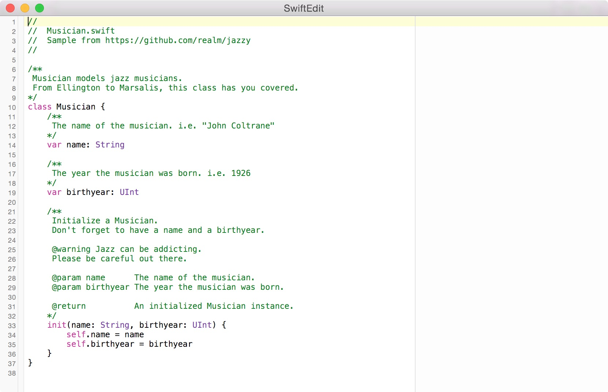

# SwiftEdit

A proof-of-concept editor, written in Swift, that supports Swift syntax
highlighting using [SourceKitten][sourcekitten].

## Requirements

* Xcode 9

## Credits

Fork of [github.com/sjhorn/SwiftEdit][original], Swift syntax highlighting by
[@jpsim](/jpsim).

## LICENSE

Swift Edit is licensed under the
[http://creativecommons.org/licenses/by-sa/3.0/][creativecommons].

[original]: https://github.com/sjhorn/SwiftEdit
[sourcekitten]: https://github.com/jpsim/SourceKitten
[creativecommons]: http://creativecommons.org/licenses/by-sa/3.0/
